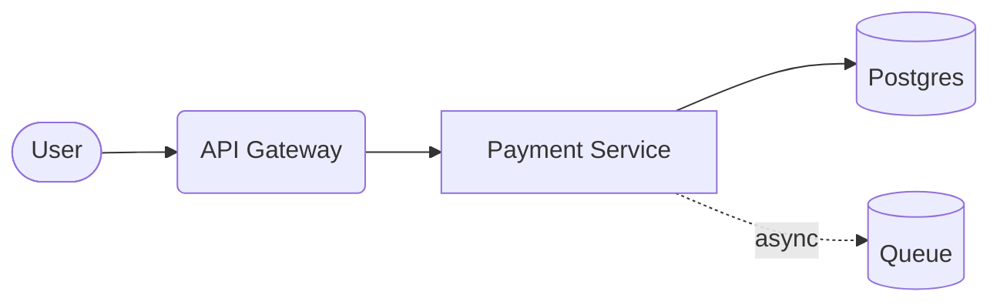
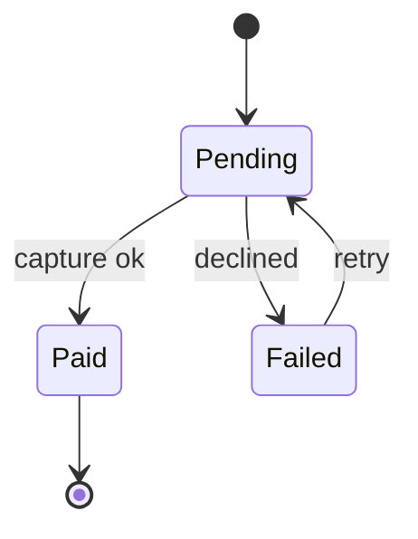
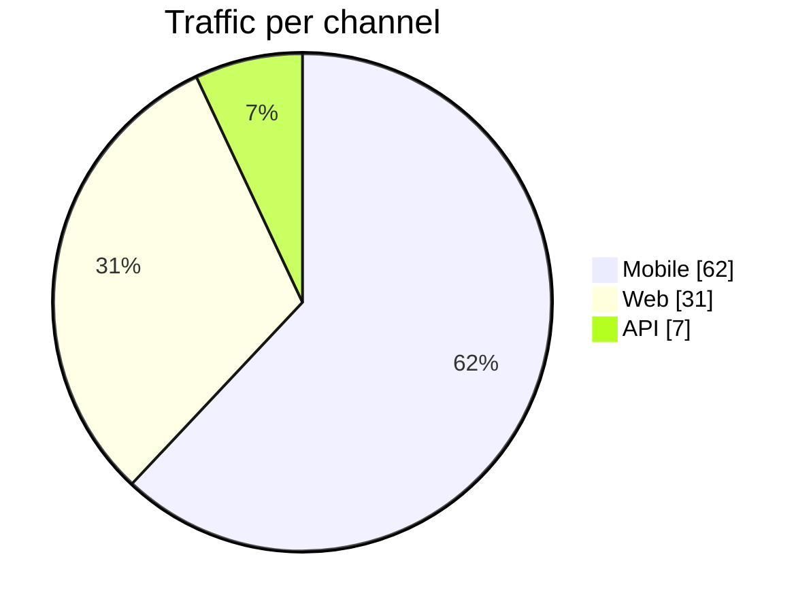

# Payment Service Design

This document exercises **every construct** markmaid supports — prose, ~~scrapped ideas~~, `inline code`, and a [runbook link](https://example.com/runbook).

## Main flow



## Transaction lifecycle

Every transaction is a small state machine:



## Architecture snapshot

The current topology, exported nightly:


## SLA per component

| Component | Target | Status |
|-----------|--------|--------|
| Gateway   | 99.9%  | **on-track** |
| Payment   | 99.95% | `at-risk` |
| Queue     | 99.5%  | on-track |

## Release checklist

- [x] load test at 2x traffic
- [x] runbook updated
- [ ] failover drill
- plain note without a checkbox
  1. nested ordered item
  2. another one

> Numbers come from the Q2 dashboard — *do not* reuse them for Q4 capacity.

## Traffic share



```rust
// a plain code block stays a code block
fn main() { println!("hello"); }
```

---

That was a thematic break. The end.
